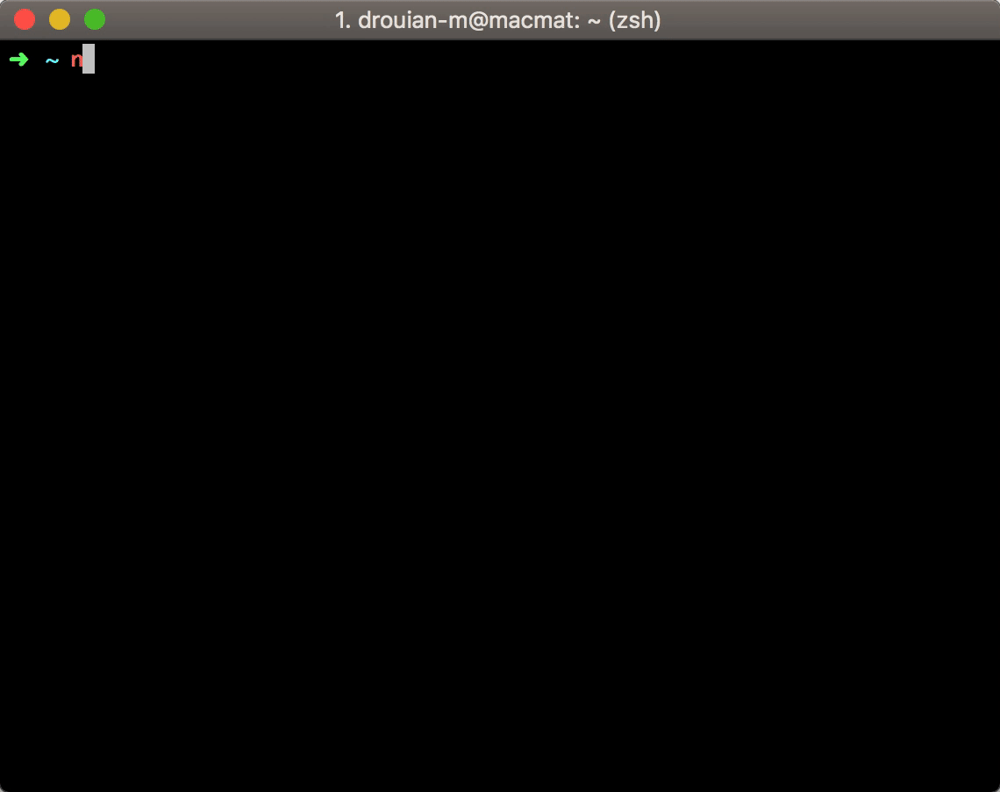

# markassin

Generate a static website from your mardown documentation.

[](https://www.npmjs.com/package/markassin)
[](https://travis-ci.org/drouian-m/markassin)
[](https://coveralls.io/github/drouian-m/markassin?branch=master)
[](https://snyk.io/test/github/drouian-m/markassin?targetFile=package.json)

## Installation

```bash
npm install -g markassin
```

## Use

```bash
markassin <source> <target>
```


### Options

* `-h, --help` output usage information
* `-V, --version` output the version number
* `-t --template` generate html with a custom template
* `-f --force` force generate (erase target dir if exists)

### Commands

* `markassin <source> <target>`  Generate website from markdown source

## Miscellaneous

Generator use Github markdown stylesheet to render html.

## Templating

To generate custom html, markassin accept input template with `--template` `t` param.

### Template format

```js
module.exports = content => `<!DOCTYPE html>
  <html>
  <head>
    head stuff here
  </head>
  <body class="markdown-body">
  ${content} // markdown transformed is injected here
  </body>
  </html>`;
`
```
